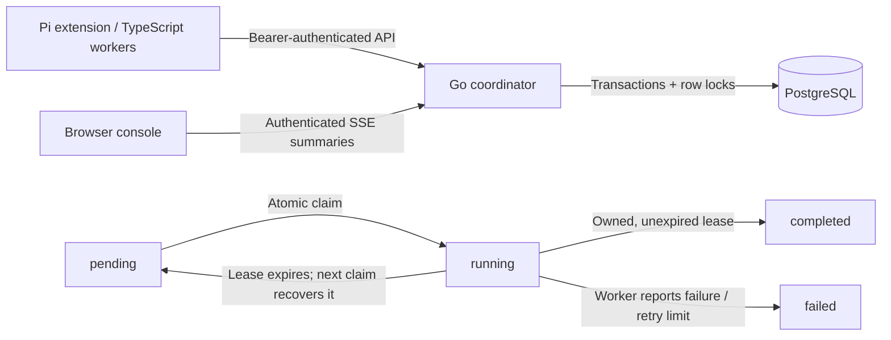

# Pi Sec Workbench

Coordinate tasks across Pi agents and independent workers, track ownership and dependencies, and monitor progress through a live console.

The workbench includes a Go API backed by PostgreSQL, a TypeScript SDK, four Pi tools and a browser interface. Task creation is idempotent, workers claim work atomically, and expired leases can be recovered by another worker.

Designed for a single trusted workspace. See [architecture](docs/architecture.md), [security](docs/security.md) and [benchmarks](docs/benchmarks.md).

## Try it

Requires Docker Compose and Node 22.18+:

```sh
node scripts/init-env.mjs
npm ci --ignore-scripts
npm run build
docker compose up --build
```

Open **http://localhost:8787**. Use the `API_TOKEN` generated in `.env` to connect. The token stays in tab memory; task summaries update via authenticated SSE. Docker publishes only on loopback and keeps PostgreSQL inside the Compose network.

In another terminal, create and process 40 synthetic tasks with four TypeScript workers:

```sh
set -a
. ./.env
set +a
npm run demo
```

The demo only hashes local fixture input. It does not run scanners, shell commands or network probes. UI-created tasks have kind `manual`; use the Pi tools or SDK to process that kind.

### Existing local PostgreSQL

Requires Go 1.25+ and PostgreSQL 14+; tested locally with Go 1.26.5, PostgreSQL 14.20 and Node 22.22.3 on macOS. The GitHub workflow checks the HTTP/SDK/PostgreSQL path and Docker Compose startup. Browser rendering is not covered by the automated tests.

```sh
createdb pi_sec_workbench_dev
createdb pi_sec_workbench_test
npm ci --ignore-scripts
npm run build
./scripts/init-local.sh
. .local/env
go run ./cmd/coordinator
```

The helper assumes a local PostgreSQL Unix socket in `/tmp`; set `DATABASE_URL` yourself for other setups. Runtime options: `LISTEN_ADDR` (default `127.0.0.1:8787`), `LEASE_DURATION` (default `30s`, range `1s..10m`), `WEB_DIR` (default `web`), and required `API_TOKEN` / `DATABASE_URL`.

## How work moves



- **Idempotent creation:** a unique request key and canonical-input fingerprint prevent duplicate creation and reject conflicting reuse.
- **Atomic claims:** `FOR UPDATE SKIP LOCKED` selects one ready task without waiting for a peer's row lock. An empty claim is transient and must be retried by a persistent worker.
- **Leases:** a random token identifies an ownership generation. Heartbeats extend it; stale tokens cannot complete or fail work. All expiry comparisons use PostgreSQL's clock.
- **Dependencies:** tasks can reference existing tasks; all parents must complete. Failed parents propagate failure on subsequent claim attempts. Existing-only dependencies make cycles impossible through this API.
- **Recovery:** subsequent claims recover up to 100 expired leases and propagate up to 100 dependency failures per call. No claim traffic means no background recovery.
- **Bounded requests:** 16 database connections, 32 concurrent short API requests, 16 SSE clients, 64 KiB request bodies, and at most 100 task/event summaries per snapshot. Counts still cover the full history.

At-least-once execution means external side effects need their own idempotency strategy. A lease fence protects coordinator state; it cannot undo a request already sent to an external service.

## Use with Pi

After installing this repository's npm dependencies:

```sh
. .local/env
pi -e ./extensions/coordinator.ts
```

Set `PI_COORDINATOR_URL` if the service is elsewhere (HTTPS required by the SDK outside loopback). The adapter exposes `workbench_create_task`, `workbench_claim_task`, `workbench_update_task` and `workbench_status`. It uses Pi's `execute(toolCallId, params, signal)` contract, with schema-validated arguments and cancellation propagation. Adapter tests verify tool registration, argument handling and cancellation.

For long work, heartbeat before the lease expires and stop side effects on ownership loss. Do not load `profiles/reference` automatically: its tools are archival and have known limitations.

## Read the code

| Path | Purpose |
|---|---|
| `internal/queue` | SQL state machine, migration, contention/recovery tests, benchmark |
| `internal/httpapi` | Authentication, validation, limits, SSE and static delivery |
| `sdk/src` | Typed API client and exact-origin URL policy |
| `extensions/coordinator.ts` | Maintained Pi adapter |
| `web` | Dependency-free TypeScript operations console |
| `scripts/demo.ts`, `scripts/e2e.ts` | Real service demos and end-to-end assertions |
| `profiles/reference` | Original security/full-stack profiles, tools, prompts and skills |
| `profiles/manifest.json` | SHA-256 inventory of sanitized reference files |

## Verify

```sh
export TEST_DATABASE_URL='postgresql:///pi_sec_workbench_test?host=/tmp&sslmode=disable'
export REQUIRE_DB_TESTS=1
npm run check
go vet ./...
go test -race -count=1 ./...
# With the coordinator running and API_TOKEN exported:
node --experimental-strip-types scripts/e2e.ts
```

Tests use isolated random schemas in the supplied **test database**, then drop only those schemas. They require schema creation privileges. `REQUIRE_DB_TESTS=1` prevents an accidentally green run with skipped integration tests. The GitHub workflow also runs the SDK end-to-end demo and scans the complete new Git history for secrets.

For benchmarks, limitations and next steps, read [architecture](docs/architecture.md), [benchmarks](docs/benchmarks.md) and [security](docs/security.md). Source inventory and licensing notes are in [provenance](docs/provenance.md).
